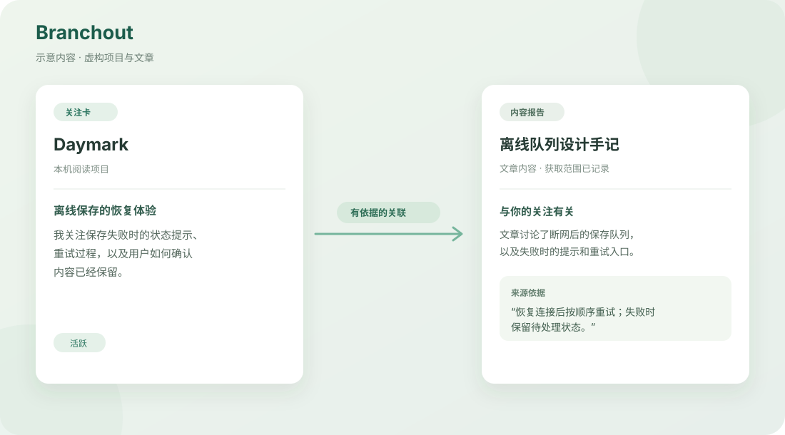

# Branchout

**让收集到的内容，和你正在做的项目产生联系。**

读到一篇文章时，你也许知道它有用，却还说不清它能帮到哪个项目。Branchout 让你为本机 Git 项目写下简短的**关注卡**。添加链接或转发到 Telegram 后，它会保存来源内容，生成阅读报告，并指出内容与哪些关注卡有关、依据是什么。项目分析还能从仓库、Git 历史和你选定的 Codex 工作对话中提出新的关注角度，供你审阅。



> 图中是专门编写的虚构示例，用于说明报告如何组织来源、理解与关联；它不是一次真实的模型输出。

## 一个使用示例

假设你正在开发本机阅读应用 **Daymark**，写下一张关注卡：

> Daymark 保存用户稍后阅读的文章。我关注离线保存失败时的状态提示、重试过程，以及用户如何确认内容已经保留。

你添加一篇讨论离线队列与失败重试的文章。Branchout 的报告会先展示实际取得的来源内容和通用理解，再判断这篇文章是否与关注卡相关。如果有关，关联项会说明文章中哪段内容支持这个判断；如果没有，报告也可以显示 **0 条关联**。关联判断直接使用卡片中的项目背景和关注角度。

## 你可以做什么

- **维护项目与关注卡**：绑定本机 Git 仓库，手写、编辑、暂停或重新启用关注卡，保留卡片版本。
- **阅读内容报告**：添加 GitHub 公开仓库、X 帖子和小红书笔记链接；查看来源正文、图片、获取范围、内容理解和有依据的关注关联。
- **从 Telegram 收集链接**：在获准聊天中发送单条链接，收到入队确认；完整报告在桌面应用中阅读。应用再次打开时继续处理 Telegram 仍提供的积压消息。
- **分析项目**：选取 Git commit 和相关 Codex 工作对话，查看实际覆盖范围、项目发现与关注卡建议；逐条审阅并接受建议。
- **查看任务进展**：在任务后台查看当前阶段、近期动作、结果与失败原因。

项目、卡片、报告和任务保存在本机。模型任务会读取本次所需的来源内容或选定的项目材料，并交给你配置的模型连接处理。

## 下载与开始使用

安装包发布在 [GitHub Releases](https://github.com/huggon1/branchout/releases)。下载 DMG，打开后将 Branchout 拖入“应用程序”。

**支持平台**

- macOS · Apple 芯片

打开应用后，在“设置”中连接通用 API 或 Codex 订阅账号。Codex 订阅连接使用本机可用的 Codex 命令行程序。然后绑定一个本机 Git 仓库，写一张关注卡，就可以从“内容”页添加链接。X 和小红书内容需在设置中完成对应登录；Telegram 转发需先配置 Bot 并授权聊天。

## 从源码运行

开发需要 Node.js 24 或更新版本：

```bash
npm ci
npm run dev
```

源码运行时，X 和小红书读取组件分别通过 `npm run setup:x`、`npm run setup:xhs` 准备。发布构建会把这些组件放入应用资源中。

## 进一步了解

- [产品设计](docs/product-spec.md)与[页面流程](docs/ux-spec.md)
- [设计系统](docs/design-system.md)
- [架构总览](docs/architecture-overview.md)、[数据契约](docs/data-contracts.md)与[源码导览](src/README.md)
