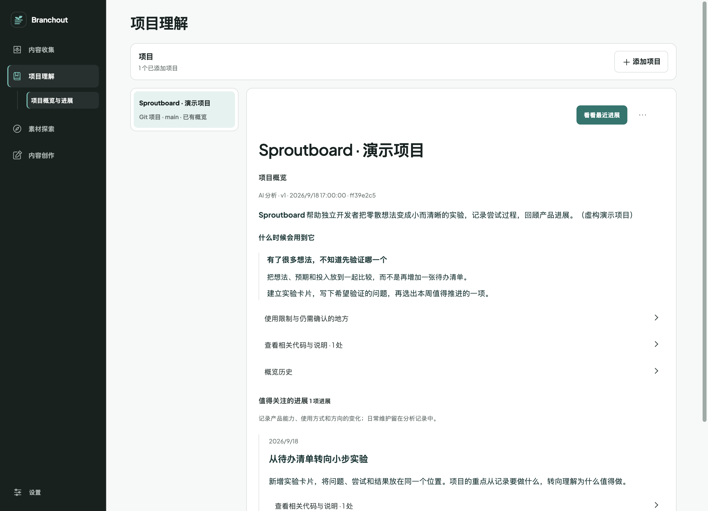
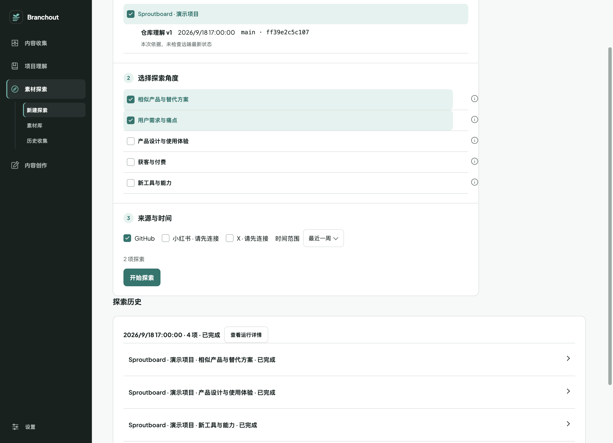
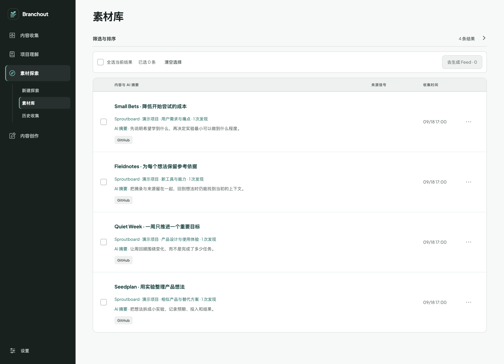
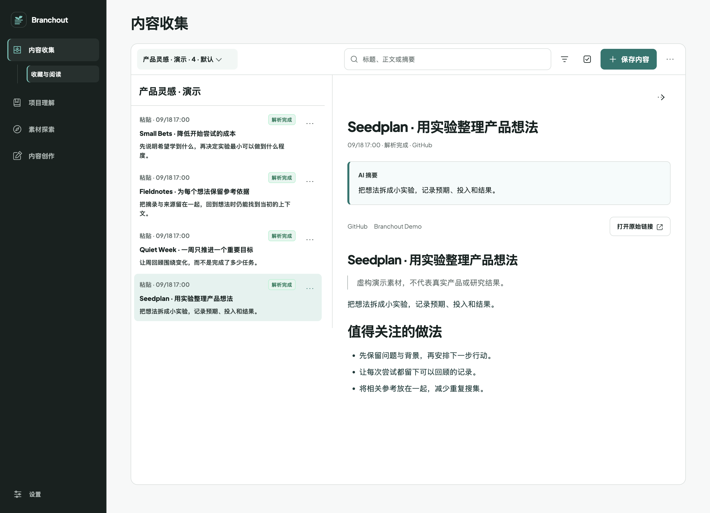

# Branchout

**让想法更充实，让构建更有信心。**

[English](README.md) · 简体中文 · [开始使用](#-开始使用) · [应用一览](#-应用一览)

构建一个项目，并不总是缺少实现能力。有时候，你不知道什么值得继续推进；有时候，你已经有了想法，但能帮助你发展它的参考、背景和见解，却散落在各个地方。

**Branchout 是面向独立开发者的项目助手。** 它从你的项目出发，帮助你发现、收集和理解有价值的信息，将零散发现逐渐积累成支持构建的视角与依据。无论你正在探索新方向，还是深入一个已有的想法，目标都是让你看得更清楚，更有信心地继续推进。

## 🌱 产品特点

### 以项目为探索起点

代码和历史提交提供了充实的出发点。Branchout 据此理解项目的能力与演进，让探索基于具体背景，而不是从空白提示词开始。

### 开箱即用的探索能力

研究方法、探索角度和平台接入已经准备好。从现成的方向中选择，即可开始探索，无需自己设计研究流程或编写提示词。

### 为正在构建的项目拓展思路

发现新的可能，也深入已有的想法。让有价值的信息更清晰，保留它背后的上下文，逐渐形成对项目方向更有依据的判断。

## 🚀 开始使用

当前支持 **Apple Silicon Mac 上的 macOS**，应用界面目前为中文。开发环境需要 **Node.js 22.19.0 或以上版本**及 Git。

```sh
git clone https://github.com/huggon1/branchout.git
cd branchout
npm ci
npm start
```

首次启动时，如缺少所需的平台运行组件，会自动下载。

1. 打开**设置**，选择 Codex 或兼容 OpenAI 的模型连接。需要使用自己的账号或 API 凭据，模型服务可能产生费用。
2. 在**项目理解**中选择本地 Git 项目，完成首次分析。
3. 在**素材探索**中选择项目、探索角度、平台和时间范围，查看发现的素材及其与项目的关联。

需要使用小红书或 X 时，再连接对应平台。Telegram 和飞书机器人是可选的转发入口，也可以直接在应用内粘贴链接。

## 🔎 应用一览

以下截图均来自真实应用，使用隔离演示空间中的虚构项目和内容，不包含个人项目、账号或真实研究结果。

### 理解已有项目

查看项目概览、值得关注的近期变化，以及背后的代码依据。分析对应固定提交，由你决定何时更新。



### 带着起点探索

当前内置角度覆盖相似产品、用户需求、产品体验、获客与付费，以及相关工具与能力。探索 GitHub、小红书和 X，查看来源及其相关性，而不只是收到一串没有解释的链接。



<details>
<summary>查看素材库</summary>

按项目、角度、平台或探索批次筛选发现。来源正文与它对不同项目的关联分别保留。



</details>

### 留住沿途发现的想法

粘贴 GitHub 或小红书链接，或通过已连接的 Telegram、飞书机器人转发。Branchout 将内容解析到本地阅读空间，提供收藏夹、原文和单独标注的 AI 摘要。



内容收集也可以独立使用。目前，收藏的链接不会自动进入项目探索或 Feed 生成。

### 将选中的发现整理成 Feed

从探索素材中选材、安排章节，生成便于阅读的 Feed。历史 Feed 保留生成时的来源快照；依据不足和失败的条目会明确展示，而不是用编造的内容补齐。

## 🛠 构建与贡献

```sh
npm run check          # 测试、类型检查、构建与文档链接检查
npm run test:desktop   # 隔离的桌面交互测试
npm run prepare:runtime
npm run package:app
```

打包产物位于 `build/Branchout-darwin-arm64/Branchout.app`。目前尚未完成签名、公证和干净机器上的分发验证。

运行 `npm run screenshots` 可复现虚构演示截图。脚本创建并清理临时空间，不使用日常应用数据。仓库规则见 [AGENTS.md](AGENTS.md)。

## 使用前了解

- 应用数据保存在本机 `~/Library/Application Support/Branchout`。这是独立的应用身份，其他安装的数据保持原样，不会自动迁移。
- 本地存储**不代表全部离线处理**。项目分析和内容生成会将相关上下文发送给配置的模型服务；外部探索会查询选定的平台。
- 探索使用固定的项目理解，不会悄悄重新分析仓库。来源访问受平台可用性、登录状态和网络环境影响。
- AI 输出不等于来源依据。在依赖结论前，请核对原始内容。

## 许可

项目尚未选定许可证。第三方组件、字体及内置运行组件遵循各自的许可证。
