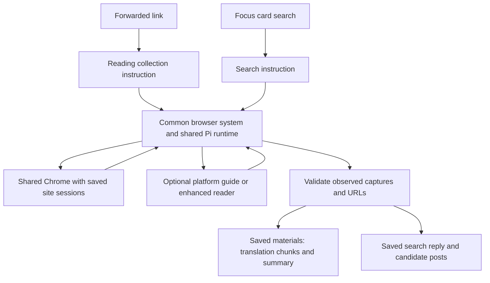

# Agent prompt flow

This document maps current prompt and tool assembly. The [architecture overview](architecture-overview.md#platform-browser-and-focus-search) owns the runtime boundaries.

| Input                                     | Owner                                                                  | Loading time                        |
| ----------------------------------------- | ---------------------------------------------------------------------- | ----------------------------------- |
| Common system                             | [Browser prompts](../src/platforms/browser/prompts.ts) `browserSystem` | Each browser task                   |
| Reading requirement                       | Same module, `materialCollectionInstruction`                           | Forwarding collection               |
| Search requirement                        | Same module, `searchInstruction` and `searchCaptureInstruction`        | Each card/platform section          |
| Browser operations, guide and enhancement | [Browser worker](../src/worker/jobs/browser/worker-entry.ts)           | Same tool definition for both tasks |
| Platform guide                            | Browser prompts `platformGuides`                                       | Agent calls guide                   |
| Optional note reader                      | [Service assembly](../src/main/services.ts)                            | Agent calls enhanced_read           |
| Translation and introduction              | [Reading prompts](../src/worker/jobs/forwarding/reading-prompts.ts)    | After original materials are saved  |

BrowserAgent sends the common system plus the task requirement to the same Pi session factory. Platform selection supplies task identity and guide selection; the shared browser allows HTTPS navigation across sites. PlatformAccess resolves selected capture IDs to saved bytes and checks reference-link provenance.

Translation preserves source Markdown. The introduction describes one material in a short paragraph. Model catalog capacity sizes chunks for known models. Custom models with absent capacity metadata use conservative input chunks and provider-default output capacity. A provider output-limit stop stores returned text and the unfinished chunk position. Summary reduction reads every translated chunk before producing the material introduction.

Translation validation restores executable code and inline identifiers from the source, compares link and image destinations, and requests one correction when preservation checks fail. A remaining mismatch saves the returned text with a partial state and retry guidance. Text diagrams and natural-language prompt examples remain translatable.
