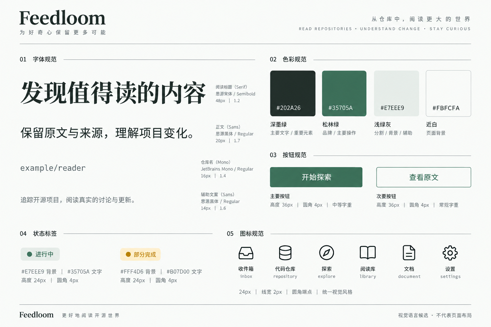
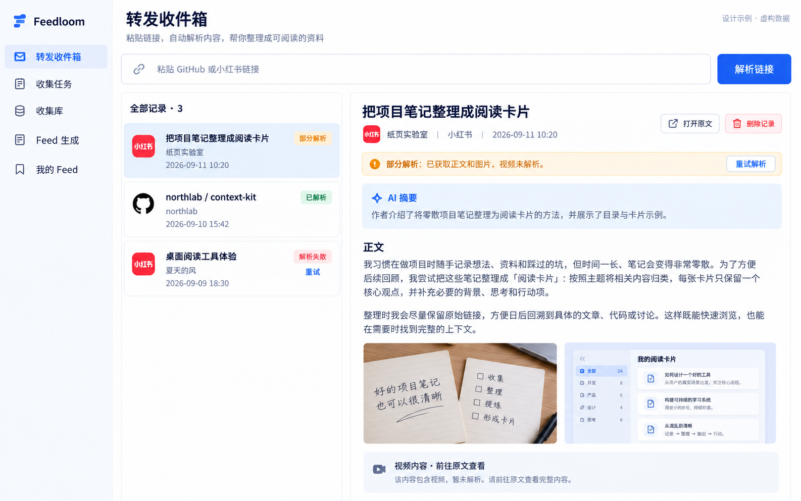
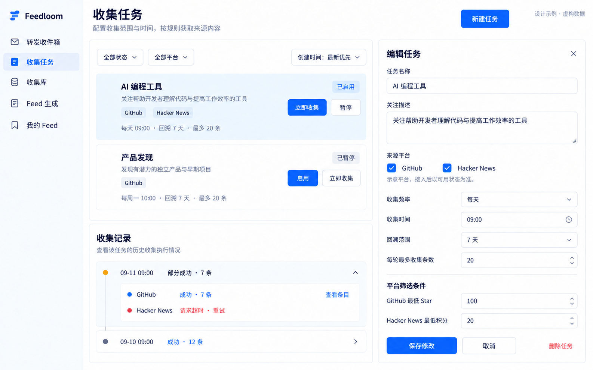
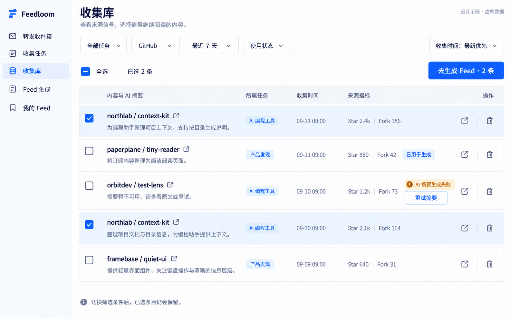
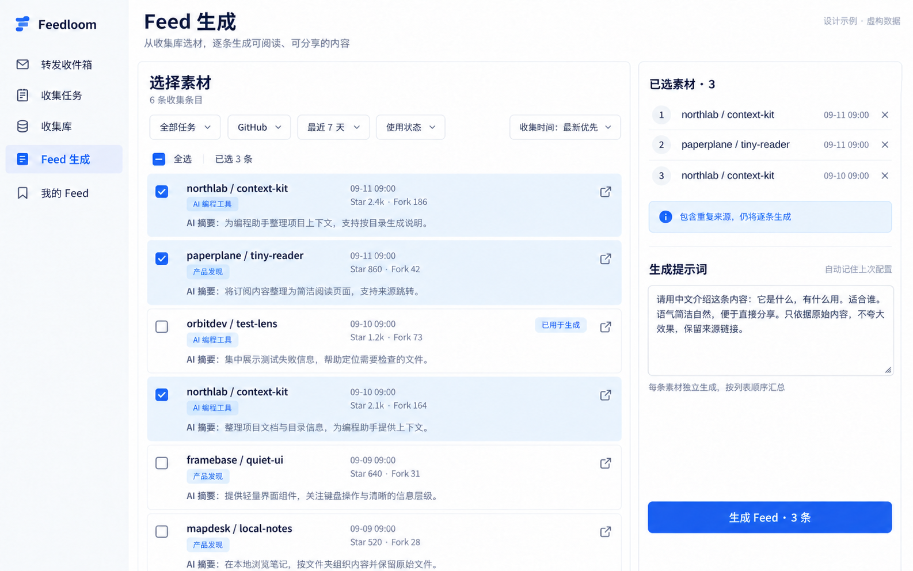
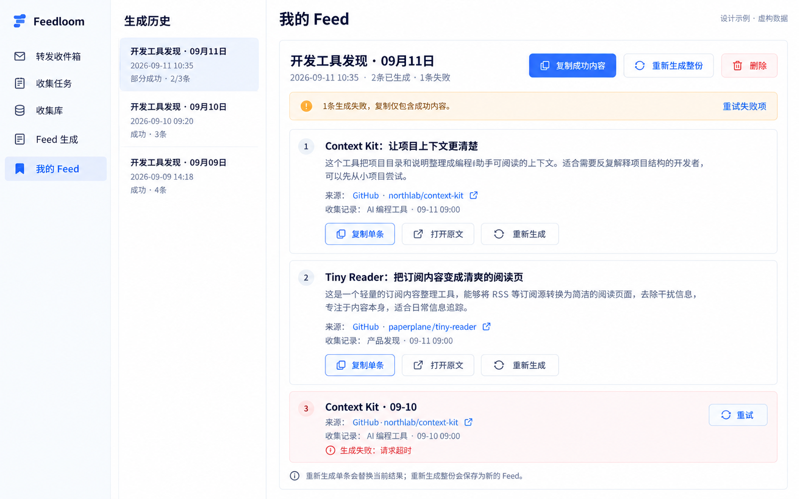

# MVP 页面设计与图稿边界

页面遵循 [MVP PRD](../mvp-prd.md)，视觉系统遵循根目录 [DESIGN.md](../../DESIGN.md)，迭代流程见[设计流程](workflow.md)。当前方向为「现代参考阅览室」：近白与墨绿、松绿操作、清晰无衬线界面、克制的衬线阅读标题。风格确认不锁定页面布局，各页面按真实任务安排内容。

下列五张旧图为**历史记录，不再作为当前颜色、字体、图标或组件的视觉依据**，其内容均为虚构示例。页面职责和下方交互验收仍需遵守。

## 已选视觉语言

这是一张生成的风格板，仅记录用户选择的色彩、字体关系与组件气质。**不是页面效果图；其中的文字、数字、尺寸及状态命名不构成产品规则。** 具体设计变量与组件用法以 [DESIGN.md](../../DESIGN.md) 和实际实现为准。生成来源与批准范围随 [来源记录](visual-language.png.json) 保存。

## 入口与页面职责

| 入口       | 内容与衔接                                                           |
| ---------- | -------------------------------------------------------------------- |
| 内容收集   | 用收藏夹整理粘贴/转发内容，查看解析状态、原文和摘要；不进入素材库    |
| 项目回顾   | 选择本机 Git 目录，手动分析，展示固定分支/commit、依据及近期变化历史 |
| 探索       | 配置仓库、角度、平台与窗口；提交后立即反馈并进入独立运行详情         |
| 探索运行   | 持久展示队列、当前行动、证据进展、缺口、真实用量、恢复操作与完成结果 |
| 素材库     | 按仓库、角度、批次和来源筛选，查看重叠关系、原文与独立理由并选材     |
| Feed 生成  | 核对去重选材、主章节、顺序和实际依据，配置生成提示词                 |
| 我的 Feed  | 分章阅读、复制和来源追溯；执行失败状态与可阅读成品分开               |
| 连接与模型 | 公开来源能力、模型及 Telegram／飞书机器人配置的独立设置入口         |

项目回顾以系统目录选择器添加本机 Git 项目，卡片不展示绝对路径；分析失败保留上次成功理解，无可用理解显示原因。旧 GitHub 项目标为只读并提供“重新关联本机目录”，不能伪装成仍可分析。当前 checkout 区显示分支和缩写 commit；分支变化须确认，detached HEAD 有独立提示。探索中的版本卡显示“理解版本 / 生成时间 / 仓库引用 / commit”，不标“最新”，不自动触发分析，也不提供理解纠正或模板编辑入口。

仓库依据通过应用内固定版本查看器打开。查看器显示文件或变更标题、固定 commit 和可读等宽正文，加载与失败状态不覆盖历史理解；打开后焦点进入关闭按钮，Tab 留在查看器内，Escape 关闭并把焦点还给来源按钮。证据查看不打开工作树路径，也不跳转到随当前 checkout 漂移的外部地址。

探索开始前明确显示仓库与角度组合总数；点击后按钮立即确认接收并防止重复启动。运行详情左侧是可键盘切换的任务队列，右侧依次展示当前行动与下一步依据、覆盖与证据缺口、真实遥测、最近 3–5 条事实事件和已完成结果。进行中、暂停、部分完成、无结果、平台受阻、用户结束、安全暂停、失败和重启后待继续使用不同文字；成功结果无需等待整批结束即可阅读。服务商不报告 token 时写明不可用，不显示虚构的 0。

## 探索运行方向契约

**THESIS：** 这是一张可随时离开再回来的运行工作台；它拒绝一次性进度弹窗和只显示百分比的黑箱任务。

**OWN-WORLD：** 沿用「现代参考阅览室」的近白纸面、细线容器、松绿操作与无衬线界面。状态靠文字与克制语义底色区分，不添加阴影、渐变或装饰性动效。

**STORY：** 用户先确认整批是否仍在推进，再在队列中切换任务，理解当前动作、下一步依据、覆盖与缺口，必要时暂停、继续或结束，同时立即阅读已经确认的结果。

**FIRST VIEWPORT：** 顶部是返回、批次状态与整批操作；下方左侧为粘性任务队列，右侧依次露出所选任务、执行阶段、当前动作、下一步依据、覆盖、缺口、真实遥测和阻塞说明。签名交互是切换队列时右侧上下文原位更新，已完成结果不因其他任务未完成而隐藏。

**FORM：** 采用既有工作区内的双栏运行详情，位于仓库探索流程之后。此项是精确指定的本地扩展，按流程不运行新方向抽签；seed key 为 `n/a-local-extension`，视觉依据由已批准的 `visual-language.png.json` 和根目录 `DESIGN.md` 共同佐证。

**FINISH：** unreviewed and undocumented is unfinished; this build ends with the finish review, the verdict, DESIGN.md, and every shipping raster carrying its provenance

## 历史图稿（已被当前视觉系统替代）

### 内容收集

当前桌面实现以收藏夹导航、内容列表、阅读详情组织任务。1280 和 1440 宽度保持有用的三栏；1100 将收藏夹导航收成整行原生选择器，避免挤压阅读栏。输入支持整段分享文案；列表标注粘贴、Telegram 或飞书，提供筛选、单选、批量选择和移动。详情分开呈现正文与摘要状态，README 图片就地显示并可预览，图片失败独立提示；不加入仓库或探索归属。

全局空、收藏夹空、筛选无匹配分别说明下一步；解析中、部分解析、正文失败、摘要失败、中断可重试、机器人待整理与提示过期均以文字和语义状态呈现。删除非空收藏夹明确说明内容将移至当前默认收藏夹。创建、重命名和管理操作沿用现有输入、弹出菜单、确认与焦点规则。

「连接与模型」包含两个机器人配置卡，展示创建步骤、凭据、连接状态、十分钟绑定码、绑定与最近接收状态、停用及失败原因。

### 原收集任务

仅参考列表、表单和状态的视觉层次。旧自由任务名称、描述、关键词和频率配置不用于新探索入口；图稿未覆盖仓库与角度组合。

### 素材库

参考紧凑列表与摘要排布。新卡片显示多个仓库与角度的发现标记，展开分别查看理由和执行依据；同来源重复发现不重复占据列表。底层保留跨日记录，卡片按当前筛选展示最近记录；已选清单显示实际日期，不能静默切换快照。

### Feed 生成

参考素材列表、已选清单和提示词并排布局。新增主章节归属与顺序核对；同来源只生成一次，多角度归属允许调整。原图允许同时选入重复来源的行为不再作为规则。

### 我的 Feed

参考历史列表和宽松阅读区。新成品按角度分章，没有成功条目的章节省略；生成状态仍列出失败或依据不足的条目及处理入口。全部无产出不能伪装成可阅读 Feed。

## 交互验收

- 桌面验证 1100×720、1280×800 和 1440×940，长仓库名、版本引用、多个发现标记和失败信息不遮挡操作。
- 项目选择、旧项目重新关联、分支变化确认、detached HEAD 和固定证据查看器均在真实 Electron 中验证；页面及截图不包含本机绝对路径。
- 项目回顾、探索和内容收集可独立进入；探索缺理解时定位到项目回顾，用户自行发起分析。
- 素材筛选不清空已选，全选只作用于当前筛选；章节和顺序在生成前明确，筛选不隐式重排。
- 原始内容、仓库理解推断和关联理由分别呈现，所有来源入口均可追溯；正文安全渲染 Markdown。
- 生成依据不足、部分失败、空章节和全失败按 PRD 验证；成品省略内容不等于隐藏失败状态。
- 内容收集验证收藏夹 CRUD、唯一默认、单条/批量移动、筛选和三种空状态；旧任务只读保留，无探索归属素材显示“历史素材”章节。
- 新界面以真实 Electron 交互验证，图稿不替代功能和来源可用性证据。

## 连接与模型

设置入口独立于业务导航。左侧按模型服务、来源平台和转发接入分组，右侧展示选中连接详情。转发机器人入口展示 Telegram／飞书配置和绑定，内容收集可直接进入该详情。模型表单按认证类型展示；当前使用、未保存、待测试和失败状态清楚区分。保存、测试、启用和删除操作分离，平台详情保留登录与能力说明。验证后台刷新时草稿保持、切换连接和离开页面时的未保存提醒。

风格板生成于品牌更名前，其中旧字标仅是历史视觉探索；当前名称与标记以 `nature-feed`、[品牌源文件](../../assets/brand.svg) 和 [设计指引](../../DESIGN.md) 为准。
