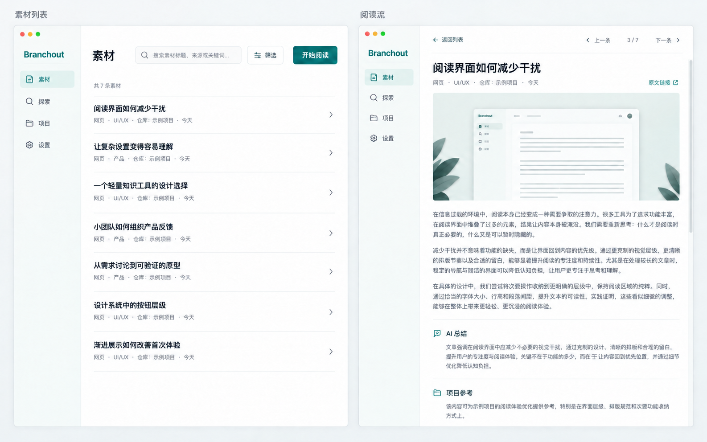

# 视觉参考

## README 宣传图

该图用于概括“项目基线 → 分支探索 → 素材阅读”的产品关系，并作为仓库 README 的开场视觉。它是目标产品的宣传设计示意，不是已实现界面的截图，也不证明任何功能已经可运行。

## 素材列表与阅读流

该图用于说明素材标题列表与阅读流的信息结构、任务分区和空间关系，是 AI 生成的概念草图，不作为已实现界面的截图。交互行为以 [UX 规格](../ux-spec.md) 为准，共用视觉规则以 [设计系统](../design-system.md) 为准。

图中的窗口尺寸、控件比例、字体大小、局部精细度、示例平台、日期和报告正文只用于表达画面，不构成最终视觉验收标准、固定界面尺寸、产品配置或真实平台能力证明。
