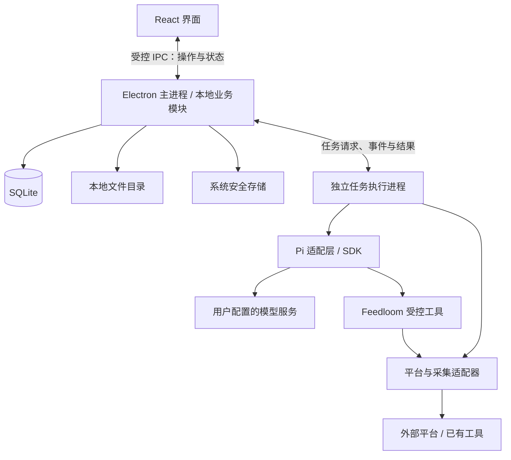

# Feedloom 技术架构

本文记录已确认的桌面 MVP 技术方案，是技术选型、模块职责和运行边界的权威文档。产品行为以 [MVP PRD](mvp-prd.md) 为准，交付阶段见[项目规划](project-plan.md)，页面参考见[设计评审](design/README.md)，当前实现见[根 README](../README.md)。

本文描述目标架构，当前已实现与已验证的范围以根 README 为准。旧版 Pitch Demo 已移除，基础接入验证不代表完整 MVP 已交付。

## 1. 技术选型

| 范围       | 选型与职责                                                             |
| ---------- | ---------------------------------------------------------------------- |
| 桌面应用   | Electron：窗口、托盘、应用生命周期和系统能力接入                       |
| 界面       | React + TypeScript，使用 Vite 构建                                     |
| 本地业务   | TypeScript：转发内容、收集任务、素材库、Feed、调度与运行状态管理       |
| Agent 底座 | Pi SDK：模型调用、受控工具执行、会话与运行事件；经 Feedloom 适配层接入 |
| 业务存储   | SQLite：业务对象、内容版本、运行记录与证据关系                         |
| 文件存储   | 应用本地数据目录：必要媒体缓存与附件                                   |
| 凭据存储   | 操作系统安全存储：模型 API Key；平台登录态由对应适配器在本机隔离管理   |

Electron 提供 Node.js 环境及可运行后台任务的独立进程。应用随包交付所需运行依赖，普通用户不需要安装开发环境或执行 CLI。具体版本在实施时按 Pi 和原生依赖的兼容性锁定。

所有 Agent 功能统一由 Pi 负责会话、工具、执行与事件处理，API 和 Codex 订阅只在模型 Provider 层分流。API 支持配置 Base URL、API Key、模型 ID 和 OpenAI 兼容接口类型；不受内置模型目录限制。Codex 模型发现和认证通过随包官方组件接入，仅允许初始化、账号读取、登录和模型列表操作，不创建线程或运行 Agent。官方目录与 Pi 支持范围交叉校验，不把尚不兼容的模型暴露为可用选择。

Codex 本机文件登录只读复用，不导入刷新令牌；独立登录在 Feedloom 数据目录由官方组件保存和刷新。认证与模型目录读取合并并发请求，Pi 只读取有效访问令牌，不能刷新凭据。API Key 经系统安全存储加密。多连接配置以版本化数据保存，升级保留原模型与计费选择；测试使用草稿且不激活连接，运行只使用已启用配置。首版不要求本地模型，也不提供统一模型额度服务。

## 2. 模块与进程边界

- **界面**只负责输入、阅读和状态展示，通过窄接口访问业务能力，不直接访问数据库、凭据或任意系统命令。
- **本地业务模块**掌握业务数据、任务调度、状态转换和证据关系。后台返回的结果通过契约校验后才写入业务存储。耗时执行放在后台，避免阻塞窗口与应用生命周期处理。
- **任务执行进程**承载 Pi 和采集适配器的执行，回传阶段、结果和错误，接受取消请求。进程隔离用于减少故障对界面的影响，不视为系统权限沙箱。
- **Pi 适配层**把底座事件和结果转换成 Feedloom 的运行契约。Pi 会话不替代业务任务记录，底座的数据结构不进入核心领域。
- **平台适配器**封装依赖库、CLI 或本地服务，将外部结果转换成核心契约，并保留可诊断的失败分类。

同一应用内按职责分模块，不建设云端业务服务、微服务、外部消息队列或通用工作流引擎。核心对象和版本化契约范围以[项目规划中的最小协作契约](project-plan.md)为准，界面术语遵循 PRD，不暴露底座内部对象。

## 3. 两条独立的数据流

### 转发解析与阅读

用户粘贴链接或分享文案，或经 Telegram／飞书机器人转发 GitHub、小红书链接，解析适配器获取可用正文或 README、作者、来源和媒体信息，模型生成明确标记的 AI 摘要，保存到转发收件箱。部分解析保留已获取内容，摘要与原文分开呈现。

转发内容不进入素材库、不参与 Feed 生成，不建立转发到收集任务的归属关系。

Telegram 通过长轮询、飞书通过官方 SDK 长连接接收，均由独立渠道适配层归一化为消息标识、本人身份和链接文本。业务模块负责绑定、持久化去重与待解析队列；消息写入与去重标记在同一事务完成，Telegram 游标随后持久化。已接收但解析中断的机器人记录在启动后继续处理，删除记录后仍保留投递去重标记。机器人凭据经系统安全存储加密，仅解密给对应渠道，界面不回传凭据。关闭与重新连接废弃旧连接，退出停止接收。

GitHub README 优先读取固定 commit 的实际 README 路径和正文，来源契约 context 保存资源基址；API 失败时回退公开 raw，并提示未固定版本。阅读层按路径解析相对链接，以白名单清洗 HTML，保留安全结构，图片独立加载与预览。媒体使用远程 HTTPS 来源，当前不承诺离线图片缓存。

### 收集、人工选材与生成

1. 用户配置收集任务的关注方向、平台、频率、回溯范围、筛选条件和各平台数量上限。任务不绑定生成提示词。
2. 调度器创建收集记录，固定本次任务配置、查询及模型预算，调用收集执行器与采集适配器。优先复用 last30days 的可验证采集入口；GitHub Trending、平台直接接口和本机服务均经适配器接入。验证原始输出、时间窗口和缺失指标；外部重排或聚合行为不能直接变成 Feedloom 的业务规则。
3. 意图模式由受预算约束的收集执行器通过 Pi 适配层理解关注方向、消歧并规划查询，经平台适配器检索候选与读取正文，再由模型判断相关性、摘取来源依据并反馈下一轮查询。模型返回结构化数据，核心模块校验候选身份与逐字摘录，确定性地执行原生指标门槛、去重和素材上限；仅接受相关且有依据的素材，其余候选保存在运行详情。固定关键词模式继续执行规则筛选。摘要与后续平台搜索解耦，不降低门槛凑数。
4. 用户跨任务、跨日期人工选材，核对顺序并配置提示词，主动触发生成。收集完成不自动生成 Feed。
5. 业务层固定本次已选素材、提示词与顺序，经 Pi 对每个素材独立生成；不进行跨素材语义合并或综合总结，也不自行扩大搜索范围。
6. 结果经过契约与来源引用校验，按所选顺序保存为一份 Feed。逐项保存成功或失败状态，部分失败保留成功内容并支持失败项重试。

Feed 指一次保存的整份成品，内部包含逐条生成内容。复制整份或单条时包含对应原始链接；全部失败不能作为可阅读成品呈现。

修改提示词后重新生成整份，保存新 Feed；单条重新生成仅在成功后替换当前结果。失败时保留原结果，不建设版本管理界面。

### 同日覆盖与证据保存

素材以来源 URL 和收集日期识别。同日再次收集更新内容、摘要和指标；不同任务共用该素材并保留各任务关系，跨日期分别保存。不承诺还原同日每轮内容快照。

生成时单独保存本次使用的素材和来源依据，并关联相应收集记录。后续覆盖或删除素材、删除任务，不改变已有 Feed 的内容与证据。保留生成依据不等于给素材库增加版本管理功能。

运行状态覆盖进行中、部分成功、无结果、鉴权失效、平台不可用和取消。平台失败不能伪装成无结果；摘要失败也不能阻止用户查看已获取的来源信息。

## 4. 后台任务与恢复

- 关闭窗口后，应用可驻留后台执行任务；明确退出应用或电脑关机后停止执行，不承诺全天在线。
- SQLite 持久化任务输入、状态、阶段和结果关联，内存计时器只负责触发，不作为任务事实来源。
- 启动或系统唤醒后核对计划与运行记录，识别错过的执行和中断任务，提示补跑；不假定任务一直在后台正常运行。
- 支持取消与有限重试。临时网络错误可以有限重试，登录失效等需要用户处理的错误应停止重试并显示原因。
- 重试和补跑需要识别已经保存的阶段结果，避免重复写入内容或发布重复 Feed。中断恢复以持久化业务记录为准，不承诺模型从中断 token 原位继续。
- 运行过程展示阶段、工具调用状态、错误及来源，不展示模型内部思维。取消、超时、后台崩溃和退出时的子进程清理都需要验证。

意图收集预算约束整个运行的查询数、候选数、模型调用数及总耗时，每个平台受轮数上限约束。平台失败保留已确认结果，重试只处理未完成平台；预算用尽与无匹配、平台失败分别记录。运行持久化操作事件、查询与候选判断，不保存模型内部思维。模型没有有效输出时失败或保守标记待确认，不能编造成功结果。

## 5. 数据与权限

SQLite 分别保存转发记录、收集任务、收集记录、素材、生成配置、Feed 及来源关系。生成记录保留当时使用的素材与提示词，后续修改不改变历史依据。必要图片与附件存放在本地文件目录，首版不默认下载完整视频或音频。

首版筛选、排序和选材行为以 PRD 为准，不额外引入素材库关键词搜索、向量库或语义检索。应用更新涉及数据结构变化时执行事务性版本迁移，旧任务保留固定关键词模式和原始配置，历史 Feed 快照保持原样；验证旧数据可继续使用；首版不建设手动备份、导出和恢复功能。

业务数据本地保存，但调用外部模型时，需要把本次处理的必要素材发送给用户配置的模型服务。本地存储不等于完全离线处理。

Pi 仅获得 Feedloom 提供的受控工具，例如读取指定素材、调用指定收集适配器和提交生成结果。不默认开放任意 Shell、任意文件访问或用户安装插件。适配器需要 CLI 时，由应用限定可执行程序、参数和数据范围。

API Key 不通过界面状态或运行日志传播；调用模型时仅向需要的执行组件提供凭据。平台登录态与业务内容分离。仓库、fixtures、测试快照和日志不得包含真实凭据或私有内容。外部内容作为数据处理，不能据其文本扩大工具权限。

### 平台连接生命周期

应用管理平台适配器及必要的浏览器依赖，用户通过设置入口完成扫码或交互验证。每个平台首版一个账号，分别检查连接、解析与收集可用性。登录态在本机隔离保存，退出连接清理对应登录态；不自动读取日常浏览器配置。

本机服务只向必要的执行组件开放；限定读取接口、回环地址、调用鉴权与受控参数。平台登录失效停止自动重试，退出应用清理所属子进程。短链接须验证跳转目标，来源规范标识与必要访问参数分开保存。原始内容按不可信数据渲染。

## 6. 实施与验证

总体上面向桌面 MVP 设计，以第一条真实闭环分阶段落地：

1. **基础集成验证**：验证 Electron 中 Pi 的模型调用、受控工具、事件流、取消和会话能力；在没有开发环境的目标机器上验证随包依赖可运行。
2. **契约与本地基础**：建立最小契约、SQLite 存储、任务状态及界面通信边界，开发中使用的模拟能力明确标记。
3. **真实流程**：分别验证转发解析阅读，以及任务收集、人工选材、提示词逐条生成、阅读复制和完整证据链。平台范围遵循 PRD，具体采集能力先盘点后确认。
4. **桌面交付验证**：验证关窗驻留、退出、睡眠唤醒、中断识别、有限重试、取消及数据升级；先验证本机安装包及随包依赖；正式对外分发前再完成签名、公证和无开发环境安装验证。

Pi 与 Luna 已完成当前 macOS 本机及打包应用内的嵌入验证。模型与平台依赖若在后续环境验证中无法满足已确认边界，应先重新评审再更换方案。

验证使用确定性契约样例与测试替身覆盖异常路径，再以真实样例检查采集与生成质量。分别验证桌面操作、任务执行和最终打包产物；网页效果或 SDK 单独运行成功都不代表桌面交付完成。

具体表字段、IPC 接口、SQLite 驱动、依赖版本、打包工具和具体收集平台在实施阶段确认，本文不提前展开。

## 7. 参考资料

- [Electron 进程模型](https://www.electronjs.org/docs/latest/tutorial/process-model)：主进程、界面与后台执行环境。
- [Pi SDK](https://github.com/earendil-works/pi/blob/main/packages/coding-agent/docs/sdk.md)：嵌入、自定义工具与会话接口。
- [SQLite 使用场景](https://www.sqlite.org/whentouse.html)：桌面应用本地数据存储。

参考资料用于解释选型能力，不代表已完成本项目运行验证；实施时按锁定版本核实兼容性。
