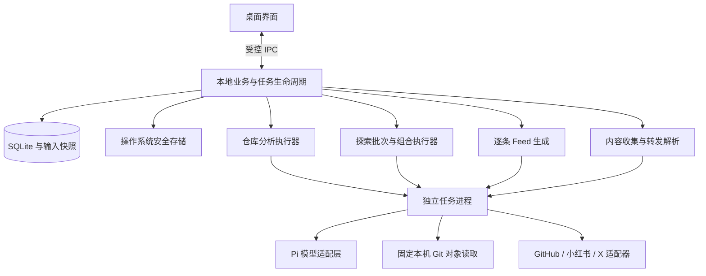

# nature-feed 技术架构

本文定义桌面产品的目标模块与运行边界，产品行为以 [MVP PRD](mvp-prd.md) 为准，实施阶段与接入选择见[项目规划](project-plan.md)。当前可运行能力与验证状态以[根 README](../README.md)为准。

## 1. 运行基础与模块

| 范围       | 选型与职责                                                                |
| ---------- | ------------------------------------------------------------------------- |
| 桌面应用   | Electron：窗口、托盘、应用生命周期和系统能力接入                          |
| 界面       | React + TypeScript，使用 Vite 构建                                        |
| 本地业务   | TypeScript：转发内容、仓库分析、探索、素材库、Feed 与运行状态管理         |
| Agent 底座 | Pi SDK：模型调用、受控工具执行、会话与运行事件；经 nature-feed 适配层接入 |
| 业务存储   | SQLite：业务对象、内容版本、运行记录与证据关系                            |
| 文件存储   | 应用本地数据目录：必要媒体缓存与附件                                      |
| 凭据存储   | 操作系统安全存储：模型 API Key；平台登录态由对应适配器在本机隔离管理      |

Electron 提供 Node.js 环境及可运行后台任务的独立进程。应用随包交付所需运行依赖，普通用户不需要安装开发环境或执行 CLI。具体版本在实施时按 Pi 和原生依赖的兼容性锁定。

所有 Agent 功能统一由 Pi 负责会话、工具、执行与事件处理，API 和 Codex 订阅只在模型 Provider 层分流。API 支持配置 Base URL、API Key、模型 ID 和 OpenAI 兼容接口类型；不受内置模型目录限制。Codex 模型发现和认证通过随包官方组件接入，仅允许初始化、账号读取、登录和模型列表操作，不创建线程或运行 Agent。官方目录与 Pi 支持范围交叉校验，不把尚不兼容的模型暴露为可用选择。

Codex 本机文件登录只读复用，不导入刷新令牌；独立登录在 nature-feed 数据目录由官方组件保存和刷新。认证与模型目录读取合并并发请求，Pi 只读取有效访问令牌，不能刷新凭据。API Key 经系统安全存储加密。多连接配置以版本化数据保存，升级保留原模型与计费选择；测试使用草稿且不激活连接，运行只使用已启用配置。首版不要求本地模型，也不提供统一模型额度服务。

Electron 主进程管理业务与窄 IPC，耗时模型与平台工作在独立任务进程执行。Pi 经适配层调用，平台经各自适配器接入，外部对象不泄漏到领域契约。

仓库分析与探索没有自动触发关系，只通过已保存的理解版本衔接。两者都是手动工作，应用没有定时调度职责。转发保留独立解析、存储和阅读路径。

界面壳层只从各领域当前状态派生四个工作空间的数量、可用性和恢复提示：内容收集、项目理解、素材探索、Feed 创作。它不复制运行生命周期、理解版本、收藏夹分配、素材选择或 Feed 快照，也不新增持久化 schema。页面、详情 ID、选择和滚动位置由渲染层在当前会话内保留；重新打开应用后的持久详情仍由领域对象及现有 IPC 状态恢复。连接与模型保持独立设置入口。

仓库分析复用 Pi SDK 的多轮执行、工具事件与压缩，仅允许固定 commit 的目录、正文与变更读取工具；不开通 Shell、写入或仓库内插件执行。Git 命令由业务适配器以参数数组执行，只访问对象库，不执行 clone、fetch、pull、checkout 或 hooks。模型输出引用工具返回的来源 ID，业务层解析为应用内 `EvidenceLocator` 并逐字核验。读取预算和模型轮次有界，不持久化内部思维。

Pi 保留现有受控文本调用基础。模型以结构化结果提出查询、候选读取、补搜或停止；业务执行器校验后经 worker 执行并统计预算。无需开放通用 Shell、任意文件工具或自动发现用户 Skills。模型服务、凭据所有权与降级规则沿用现有适配器边界，不自动切换计费路径。

## 2. 核心对象与快照

| 对象            | 职责与关键关系                                                                   |
| --------------- | -------------------------------------------------------------------------------- |
| 绑定仓库        | 稳定应用身份、私有本机目录映射、当前分支/commit 及成功分析引用；路径不进入领域状态 |
| 仓库分析运行    | 开始/结束边界、固定输入引用、读取完整度、模型状态及失败原因                      |
| 仓库理解版本    | 产品定位、使用情境、必要边界、文件/change/commit 依据、生成时间；保存后不可变    |
| 近期变化结果    | 归属于分析运行的独立产出，与主理解分别呈现                                       |
| 探索模板版本    | 内置角度、启动提示词、目标、平台语言策略、证据与排除规则                         |
| 探索批次        | 用户一次选择形成的组合列表及总量、并发约束与汇总状态                             |
| 探索组合运行    | 一个仓库理解版本 × 一个模板版本；固定平台、窗口、进度、遥测、检查点和执行观察    |
| 来源素材        | 规范来源身份、正文、元信息、完整度和忠于来源的摘要                               |
| 发现关系        | 素材与组合运行的关系、独立关联理由、摘录和时间证据；不能由素材最新正文反推旧理由 |
| Feed 输入与结果 | 选中素材快照、发现关系及理解/模板版本、主章节、顺序、提示词和逐条状态            |
| 收藏夹          | 名称、唯一默认标记及创建/更新时间；容器与转发内容本体分离                        |
| 内容分配        | 内容、收藏夹、分配来源/时间及可选消息批次；收藏夹整理只由桌面应用修改            |

用户粘贴链接或分享文案，或经 Telegram／飞书机器人转发 GitHub、小红书链接，记录先持久化到当时的默认收藏夹；同一机器人消息的多条链接共享接收批次身份。机器人不接收收藏夹命令，也不创建或移动收藏夹；这些操作只在桌面完成。解析适配器获取可用正文或 README、作者、来源和媒体信息，模型生成明确标记的 AI 摘要。部分解析保留已获取内容，摘要与原文分开呈现。收藏夹分配不改变转发内容数据，也不建立素材、发现关系或 Feed 输入。

运行时 schema 与导出的版本化契约同步，结构约束之外验证身份、引用、窗口与摘录。数据库 schema 升级版本与业务对象版本分别管理；具体表字段和 IPC 签名在实现阶段确定。

素材表继续按来源身份与日期唯一，列表按规范来源身份去重。发现关系单独保存每次判断的正文快照。历史 Feed 自带生成依据，不依赖可被更新或删除的“当前理解”或“当前素材”引用。

Telegram 通过长轮询、飞书通过官方 SDK 长连接接收，均由独立渠道适配层归一化为消息标识、本人身份和链接文本。业务模块负责绑定、持久化去重与待解析队列；消息和默认收藏夹分配与去重标记在同一事务完成，Telegram 游标随后持久化。已接收但解析中断的机器人记录在启动后继续处理，删除记录后仍保留投递去重标记。机器人只回复接收和解析结果，不解释数字、名称或其他收藏夹命令。机器人凭据经系统安全存储加密，仅解密给对应渠道，界面不回传凭据。关闭与重新连接废弃旧连接，退出停止接收。

GitHub README 优先读取固定 commit 的实际 README 路径和正文，来源契约 context 保存资源基址；API 失败时回退公开 raw，并提示未固定版本。阅读层按路径解析相对链接，以白名单清洗 HTML，保留安全结构，图片独立加载与预览。媒体使用远程 HTTPS 来源，当前不承诺离线图片缓存。

## 3. 仓库分析数据流

1. 用户选择本机 Git 工作目录；主进程保存应用项目 ID 到绝对路径的私有映射，领域状态只保存稳定身份、显示名称、分支与 commit。用户发起分析时重新检查 checkout，并固定仓库引用、分支、commit、时间及增量边界。
2. 本机 Git 适配器通过 `rev-parse`、`cat-file`、`ls-tree`、`log`、`diff-tree` 与 `show` 等只读对象命令获取必要文档、相关代码、commit 及变更上下文；排除工作树未提交/未跟踪内容、符号链接与 submodule，并记录截断和缺失。仓库内容包括 README 中的指令均作为数据，不允许扩大权限。
3. 分析执行器从固定当前内容形成或核对产品主理解，同时从本轮增量生成近期变化结果。主理解更新核对原始内容，不无限累积摘要。产品理解不足与执行失败分开处理。
4. 概览先多轮读取核对，再由独立的无工具编辑调用基于已读原文整理使用情境，避免把内部实现直接搬到产品介绍。通过结构、公开搜索上下文与实际读取摘录校验后，事务性发布不可变理解版本；增量清单、详情、分批分析分别持久化。每个提交必须归入产品进展、支持性的实现记录、机械排除或未解决状态，全部处理后归并跨批次的重复产品进展，原始记录继续保留供查询；归并成功才在事务中保存时间线并推进变化边界。
5. 失败、取消和中断保留已完成阶段；概要与时间线可分别完成。重试固定原版本并复用检查点，不重新解释已完成批次。概要失败但时间线成功时，只重试未完成阶段。

概览分析格式升级时，即使 commit 未变也重新生成概览，不重写旧快照或回退增量边界。旧进展未经过重要性分类，不默认展示，但仍保留在分析记录及本地历史检索中。

首次增量窗口为最近 7 天；之后从上次成功边界继续，到本次开始时固定的结束点。执行过程中出现的变化留到下一轮。commit 按固定历史去重，避免同一变更被重复当作独立决策。分析范围为开始时 checkout 的分支历史；detached HEAD 固定为明确状态，不猜测默认分支。

不能只以“最新时间”证明已完整扫描：需要校验边界连续性。工作树分支变化时重新分析前必须显式确认，取消不修改绑定；历史重写或基准 commit 不可达时标明边界失效，不静默跳过变更。旧 GitHub 项目重新关联时，仅当旧边界是当前 commit 的祖先才沿用身份，否则创建独立项目。同一仓库分析串行化，防止较旧运行覆盖较新成功指针。

## 4. 探索与受控 Agent 循环

### 固定输入与组合隔离

用户提交仓库、角度和平台选择后，业务层在同一次输入确认中固定所有仓库的可用理解版本；无可用版本返回可定位的错误，不自动分析。每个组合复制必要输入及版本证据和当时已发布的开发时间线，后续当前版本变化不影响执行和重试。规划器从概览的产品需求与使用情境出发；初始索引仅包含标记为产品进展的条目，按问题搜索时可查全部实现记录与历史。实际读取条目写入发现关系；只对外发送抽象搜索词。

批次负责排队、暂停、继续、用户结束与汇总；组合负责研究观察、单项暂停／继续和结果，不共享另一个仓库的推断。配置提交以 `launchKey` 幂等创建并先持久化，再导航到运行详情。组合内允许使用已选平台的证据规划后续搜索，消除原有仅本平台反馈的限制；不做跨组合自动调配研究重点。

### 查询、读取和判断

模板将产品主理解转成研究问题及证据标准。规划输入包含平台能力、实际窗口、目标社区、已搜表达、候选判断、覆盖与证据缺口；结构化输出包含目标、平台、语言、查询或候选读取动作及简短理由。

来源适配器提供搜索与正文读取。业务层验证动作的平台、候选身份、链接、隐私和单次调用约束后执行，将结果反馈给规划器。模型可选择补读已有平台候选，不只消费搜索返回的标题。候选正文不足时标待确认，不假定空正文意味着无关。

判断同时检查产品相关性、来源忠实度与近期活动证据。模型摘录必须逐字存在于对应已获取文本，引用必须指向真实输入来源；累计指标、搜索排序或模型自评不证明质量。时间依据保留平台含义，GitHub pushed 时间不能被改写成产品发布日期或讨论热度。

### 停止、记账与状态

记录研究问题覆盖、证据缺口、新规范来源、候选判断、正文／时间补全和阻塞变化，用于解释继续或停止。模型停止提议由核心校验是否存在对应观察；不接受没有执行记录的“充分”。已有可用素材、启用平台均已尝试且连续两次正常搜索没有新增来源时，可判定边际收益降低并停止，保留来源未穷尽的说明。无素材时，各平台须完成明确的不同策略且没有阻塞才可判定无结果；不设置最低素材产出要求。

新探索不以搜索、正文读取、候选、模型调用、步骤或总耗时的固定总量结束正常运行。单次调用仍由 worker／provider deadline、AbortSignal、上下文窗口和输出上限约束；隐私校验、平台约束、来源身份和发现关系幂等仍在每个动作执行前后生效。继续运行保留已有证据与累计遥测。重复、二态摆动或持续无可提交进展写入检查点并进入可恢复安全暂停。

复用 `RunProgress` 与 `RunTelemetry` 契约，生命周期、证据结果和停止原因分离；本次仅完整迁移素材探索。进度持久化阶段、当前行动、证据 delta、剩余缺口、下一行动依据、覆盖和心跳；遥测持久化调用、查询、补读、候选及服务商实际报告的 token。缺失 token 保存为 `unavailable`。事实事件只记录查询、来源、摘录、判断、阻塞与生命周期变化，不记录模型内部思维。

## 5. 素材、发现关系与 Feed

规范化来源身份负责同源去重，发现关系负责来源为何与某个仓库和角度有关。关系写入以运行和候选身份幂等；正文更新不能覆盖其他组合理由，来源 URL 相似不能作为跨来源合并依据。

素材摘要独立于仓库关联判断。即使卡片显示最新正文，历史发现和 Feed 仍保留当时使用的正文、摘录和关系快照。删除素材或解除绑定不能破坏既有 Feed 的引用证据；凭据不进入快照。

生成前核心固定选材、来源快照、发现关系、主章节及顺序，确保同来源只出现一次。模型逐项读取正文和选定的关联上下文，返回有内容、依据不足或执行错误；不把空输出当成功，也不让生成提示词改变已选来源或章节结构。

业务层按固定章节组装成功条目，省略空章，但保留所有逐项状态及输入。全部无可用内容保留为生成记录，不作为可阅读成品；部分成功允许阅读和复制成功项。重新生成整份保存新 Feed；单条替换事务在新结果成功后才覆盖旧内容。历史版本快照与重试配置保持原规则。

## 6. 连接、网络与隐私

本机项目读取与 GitHub 外部发现是不同能力。前者只读取用户选择目录中固定 commit 的 Git 对象；后者使用抽象产品需求检索公开信息。项目绝对路径仅存在主进程私有映射，不通过模型提示、搜索词、UI 业务状态、日志或结果传播。

私有仓库理解及必要代码可发送至用户配置的模型服务用于分析；外部搜索输入仅包含抽象场景和需求，不含私有代码、内部名称或凭据。生成对外查询前执行输入最小化和约束检查，无法安全形成查询时停止该动作并说明原因，不直接传递全文理解。

本版不接入通用网页搜索。GitHub、小红书和 X 的正文补读使用各自适配器；X 目前保留搜索获取的正文，完整线程补读不可用时显式返回读取限制。

来源正文安全渲染 Markdown，原始 HTML 不执行。平台适配器的本地服务仍限定回环、受控参数与鉴权；来源地址不能直接转为任意本地读取工具。正文中的指令不能改变工具权限、预算、窗口或搜索平台。

GitHub 公开读取继续服务转发与外部探索，不配置项目仓库 Token。项目分析不访问网络、不自动同步远端，也不读取用户浏览器或 GitHub CLI 登录态。

## 7. 生命周期与迁移

运行输入、进度、检查点、事实事件、候选、关系、遥测和成功结果持久化。关窗驻留；退出中止所属 worker并标为重启后待继续，启动时不自动执行，用户手动继续。没有后台定时任务、错过计划补跑或自动重试登录失效平台。

数据库升级事务性执行，兼容读取原有转发、任务记录、素材和 Feed 快照，不伪造理解版本或模板关系。迁移按有序模块注册，后续版本可追加而不改写已执行步骤。v4 将旧探索运行映射到新的生命周期、结果、进度与遥测；v5 随后创建不导出到业务状态的 `local_bindings` 并清理已停用的项目仓库凭据，旧 GitHub 项目默认只读；v6 再创建收藏夹和内容分配表，为每条旧转发记录建立指向默认 `Inbox` 的迁移分配，且不改写 `inbox.data`。v7 只保留已由测试版创建的机器人整理表兼容结构；当前运行时不读写或展示该表及旧整理状态，也不删除历史行。迁移失败回滚 schema、分配与版本号，重复打开 v7 数据库不重复迁移。历史 `CollectionBudget` 继续用于旧任务读取，不属于新探索契约。关闭旧定时触发路径与保留旧证据是两个独立步骤；不得通过删除旧数据达到停用调度。历史任务只读保留，无角度素材进入“历史素材”章节。

实施和测试落点见[项目规划](project-plan.md)。持久化测试重点覆盖分析指针与边界的原子推进、并发与取消、关系幂等、历史快照及升级失败回滚；受控模型测试只证明机制，真实中英文搜索和报告阅读另行验收。
