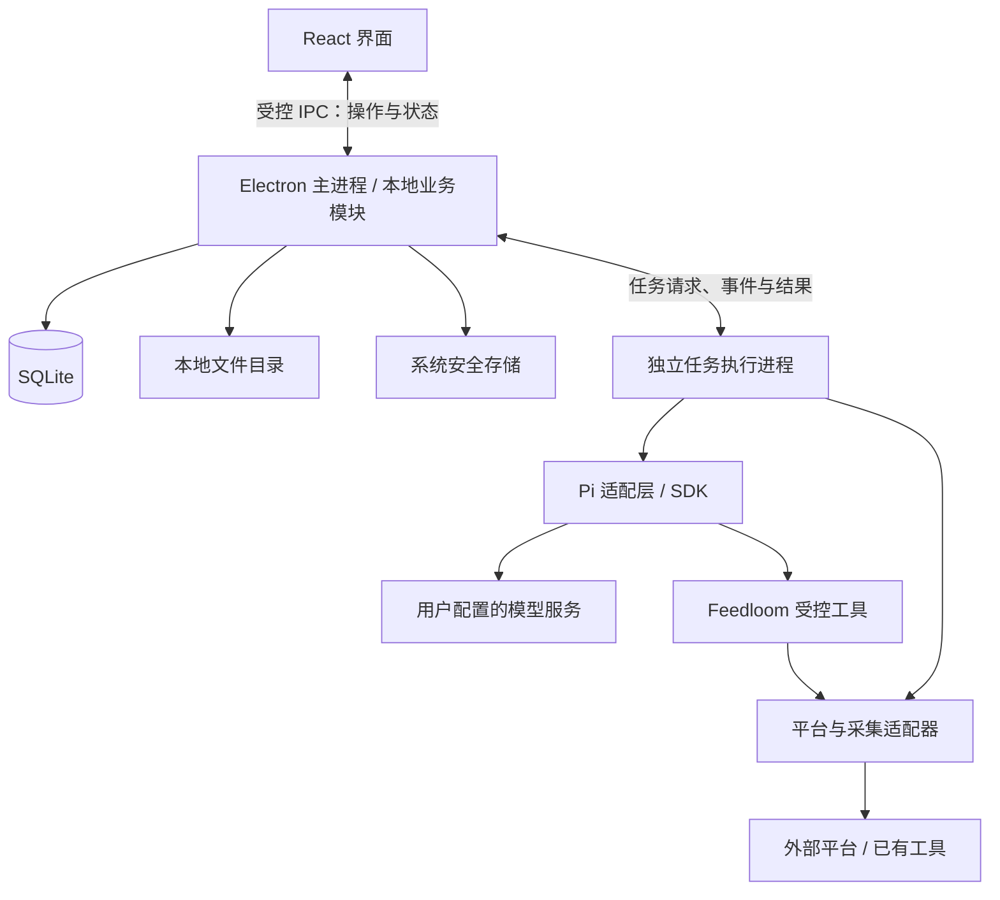

# Feedloom 技术架构

本文记录已确认的桌面 MVP 技术方案，是技术选型、模块职责和运行边界的权威文档。产品行为以 [MVP PRD](mvp-prd.md) 为准，交付阶段见[项目规划](project-plan.md)，页面参考见[设计评审](design/README.md)，当前实现见[根 README](../README.md)。

这些是待实施的目标架构。当前仓库仍是确定性假数据支持的网页 Pitch，尚未完成桌面打包、Pi 集成或真实平台验证。

## 1. 技术选型

| 范围 | 选型与职责 |
| --- | --- |
| 桌面应用 | Electron：窗口、托盘、应用生命周期和系统能力接入 |
| 界面 | React + TypeScript，使用 Vite 构建 |
| 本地业务 | TypeScript：转发内容、收集任务、收集库、Feed、调度与运行状态管理 |
| Agent 底座 | Pi SDK：模型调用、受控工具执行、会话与运行事件；经 Feedloom 适配层接入 |
| 业务存储 | SQLite：业务对象、内容版本、运行记录与证据关系 |
| 文件存储 | 应用本地数据目录：必要媒体缓存与附件 |
| 凭据存储 | 操作系统安全存储：模型 API Key；平台登录态由对应适配器在本机隔离管理 |

Electron 提供 Node.js 环境及可运行后台任务的独立进程。应用随包交付所需运行依赖，普通用户不需要安装开发环境或执行 CLI。具体版本在实施时按 Pi 和原生依赖的兼容性锁定。

模型由用户提供 API Key，首版打通一种模型接口，通过适配器保留扩展空间。首版不要求本地模型，也不提供统一模型额度服务。

## 2. 模块与进程边界

- **界面**只负责输入、阅读和状态展示，通过窄接口访问业务能力，不直接访问数据库、凭据或任意系统命令。
- **本地业务模块**掌握业务数据、任务调度、状态转换和证据关系。后台返回的结果通过契约校验后才写入业务存储。耗时执行放在后台，避免阻塞窗口与应用生命周期处理。
- **任务执行进程**承载 Pi 和采集适配器的执行，回传阶段、结果和错误，接受取消请求。进程隔离用于减少故障对界面的影响，不视为系统权限沙箱。
- **Pi 适配层**把底座事件和结果转换成 Feedloom 的运行契约。Pi 会话不替代业务任务记录，底座的数据结构不进入核心领域。
- **平台适配器**封装依赖库、CLI 或本地服务，将外部结果转换成核心契约，并保留可诊断的失败分类。

同一应用内按职责分模块，不建设云端业务服务、微服务、外部消息队列或通用工作流引擎。核心对象和版本化契约范围以[项目规划中的最小协作契约](project-plan.md)为准，界面术语遵循 PRD，不暴露底座内部对象。

## 3. 两条独立的数据流

### 转发解析与阅读

用户粘贴 GitHub 或小红书链接，解析适配器获取可用正文或 README、作者、来源和媒体信息，模型生成明确标记的 AI 摘要，保存到转发收件箱。部分解析保留已获取内容，摘要与原文分开呈现。

转发内容不进入收集库、不参与 Feed 生成，不建立转发到收集任务的归属关系。

### 收集、人工选材与生成

1. 用户配置收集任务的关注方向、平台、频率、回溯范围、筛选条件和数量上限。任务不绑定生成提示词。
2. 调度器创建收集记录，调用采集适配器。以 last30days 为能力基础，验证来源、时间窗口和指标后再接入；外部重排或聚合行为不能直接变成 Feedloom 的业务规则。
3. 按明确规则筛选并写入收集库；模型只生成摘要，不隐藏条目、不合并来源、不降低门槛凑足数量。每轮保留平台状态与条目关系。
4. 用户跨任务、跨日期人工选材，核对顺序并配置提示词，主动触发生成。收集完成不自动生成 Feed。
5. 业务层固定本次已选素材、提示词与顺序，经 Pi 对每个条目独立生成；不进行跨条目语义合并或综合总结，也不自行扩大搜索范围。
6. 结果经过契约与来源引用校验，按所选顺序保存为一份 Feed。逐项保存成功或失败状态，部分失败保留成功内容并支持失败项重试。

Feed 指一次保存的整份成品，内部包含逐条生成内容。复制整份或单条时包含对应原始链接；全部失败不能作为可阅读成品呈现。

修改提示词后重新生成整份，保存新 Feed；单条重新生成仅在成功后替换当前结果。失败时保留原结果，不建设版本管理界面。

### 同日覆盖与证据保存

收集条目以来源 URL 和收集日期识别。同日再次收集更新内容、摘要和指标；不同任务共用该条目并保留各任务关系，跨日期分别保存。不承诺还原同日每轮内容快照。

生成时单独保存本次使用的素材和来源依据，并关联相应收集记录。后续覆盖或删除收集条目、删除任务，不改变已有 Feed 的内容与证据。保留生成依据不等于给收集库增加版本管理功能。

运行状态覆盖进行中、部分成功、无结果、鉴权失效、平台不可用和取消。平台失败不能伪装成无结果；摘要失败也不能阻止用户查看已获取的来源信息。

## 4. 后台任务与恢复

- 关闭窗口后，应用可驻留后台执行任务；明确退出应用或电脑关机后停止执行，不承诺全天在线。
- SQLite 持久化任务输入、状态、阶段和结果关联，内存计时器只负责触发，不作为任务事实来源。
- 启动或系统唤醒后核对计划与运行记录，识别错过的执行和中断任务，提示补跑；不假定任务一直在后台正常运行。
- 支持取消与有限重试。临时网络错误可以有限重试，登录失效等需要用户处理的错误应停止重试并显示原因。
- 重试和补跑需要识别已经保存的阶段结果，避免重复写入内容或发布重复 Feed。中断恢复以持久化业务记录为准，不承诺模型从中断 token 原位继续。
- 运行过程展示阶段、工具调用状态、错误及来源，不展示模型内部思维。取消、超时、后台崩溃和退出时的子进程清理都需要验证。

具体并发数、重试次数和补跑交互留到实现设计时确定。

## 5. 数据与权限

SQLite 分别保存转发记录、收集任务、收集记录、收集条目、生成配置、Feed 及来源关系。生成记录保留当时使用的素材与提示词，后续修改不改变历史依据。必要图片与附件存放在本地文件目录，首版不默认下载完整视频或音频。

首版筛选、排序和选材行为以 PRD 为准，不额外引入关键词搜索、向量库或语义检索。应用更新涉及数据结构变化时执行版本化迁移，验证旧数据可继续使用；首版不建设手动备份、导出和恢复功能。

业务数据本地保存，但调用外部模型时，需要把本次处理的必要素材发送给用户配置的模型服务。本地存储不等于完全离线处理。

Pi 仅获得 Feedloom 提供的受控工具，例如读取指定素材、调用指定收集适配器和提交生成结果。不默认开放任意 Shell、任意文件访问或用户安装插件。适配器需要 CLI 时，由应用限定可执行程序、参数和数据范围。

API Key 不通过界面状态或运行日志传播；调用模型时仅向需要的执行组件提供凭据。平台登录态与业务内容分离。仓库、fixtures、测试快照和日志不得包含真实凭据或私有内容。外部内容作为数据处理，不能据其文本扩大工具权限。

## 6. 实施与验证

总体上面向桌面 MVP 设计，以第一条真实闭环分阶段落地：

1. **基础集成验证**：验证 Electron 中 Pi 的模型调用、受控工具、事件流、取消和会话能力；在没有开发环境的目标机器上验证随包依赖可运行。
2. **契约与本地基础**：建立最小契约、SQLite 存储、任务状态及界面通信边界，保留原有 Pitch 的模拟标记。
3. **真实流程**：分别验证转发解析阅读，以及任务收集、人工选材、提示词逐条生成、阅读复制和完整证据链。平台范围遵循 PRD，具体采集能力先盘点后确认。
4. **桌面交付验证**：验证关窗驻留、退出、睡眠唤醒、中断识别、有限重试、取消及数据升级；完成 macOS 安装包签名、公证和无开发环境安装验证。

Pi 的选择是目标选型，尚不能视为完成嵌入验证。若基础验证发现无法满足已确认边界，应先重新评审再更换方案。

验证使用确定性契约样例与测试替身覆盖异常路径，再以真实样例检查采集与生成质量。分别验证桌面操作、任务执行和最终打包产物；网页效果或 SDK 单独运行成功都不代表桌面交付完成。

具体表字段、IPC 接口、SQLite 驱动、依赖版本、打包工具和具体收集平台在实施阶段确认，本文不提前展开。

## 7. 参考资料

- [Electron 进程模型](https://www.electronjs.org/docs/latest/tutorial/process-model)：主进程、界面与后台执行环境。
- [Pi SDK](https://github.com/earendil-works/pi/blob/main/packages/coding-agent/docs/sdk.md)：嵌入、自定义工具与会话接口。
- [SQLite 使用场景](https://www.sqlite.org/whentouse.html)：桌面应用本地数据存储。

参考资料用于解释选型能力，不代表已完成本项目运行验证；实施时按锁定版本核实兼容性。
